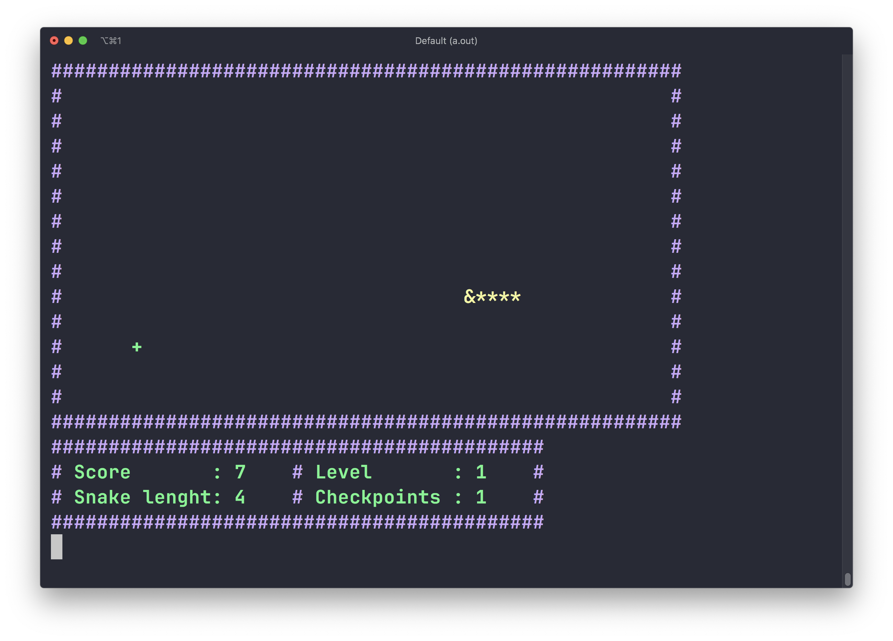

# TermiSnake
 Termisnake is a retro-inspired Snake game played right in your terminal! Navigate the grid, eat food to grow, and avoid walls or yourself in this fast-paced, minimalist arcade classic.
# Did you know?
snake game is the first electronic game i ever played in my childhood, today i took a chance to make my own :D
# Techniques
#### The time and space complexity are taken care of the game uses a 2D array  to make indexing and moving a long the playing board easy and fast.
#### include Linked list, in the snake segments as it is perfetct for this purpose.
# Feutures
1. The playing board is dynamic, which means the player can decide the width and height of the field he wish to play on.
2. The game has 9 defferent Levels, which effect the snake moving speed (1 is slow and 9 is fast)
3. The score calculation considers the level you are playing and the lenght of the snake.
4. The game is colored simply to make it more fun and better.
5. While playing, a field will apear and display some infos dinamically, like level, and score, food eaten...
6. The snake moves strightly into an instruction is given, a direction by pressing the arrows.
# usage
## 1. clone this repo:
```
git clone https://github.com/aalahyan3/TermiSnake TermiSnake
```
## 2. locate the folder in your Terminal.
` cd /path/to/TermiSnake`
## 2.compile the program
```
cc temisnake.c assets/*.c -o termisnake
```
## 3. run the program and follow instructions
`./termisnake`
## 4. enjoy
# ScreenShots

